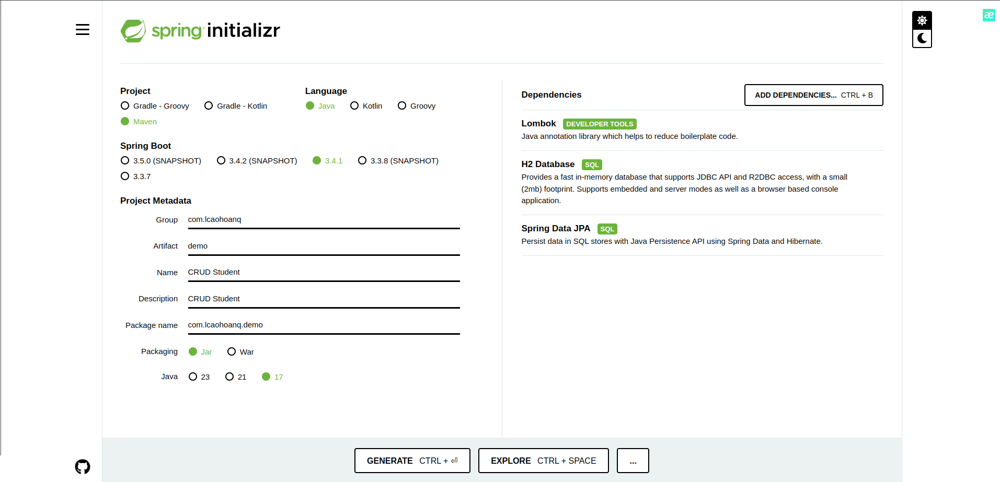

# Tạo Project

- Có 2 cách tạo project Spring Boot:
  - Sử dụng [Spring Initializr](https://start.spring.io/)
  - Sử dụng Spring Tool Suite (STS) hoặc IntelliJ IDEA

- Mình sẽ tạo trên Spring Initializr, vì nó đơn giản và nhanh chóng.



- Project: Maven
- Language: Java 17
- Spring Boot: 3.4.1
- Dependencies:
  - Lombok
  - H2 Database
  - Spring Data JPA

- Cần thêm gì thì vô pom.xml add sau, 3 cái trên là cơ bản.

# Coding

- User Entity, User Model,...
- Đây là một bảng trong DB với tên users
- Điều kiện để trở thành một Entity là xài 2 annotation: @Entity, @Table
- Ngoài ra mình còn sử dụng những annotation của Lombok

```java
package com.lcaohoanq.demo.domain.user;

import jakarta.persistence.*;
import lombok.*;

@Getter
@Setter
@Builder
@NoArgsConstructor
@AllArgsConstructor
@Entity
@Table(name = "users")
public class User {

    @Id
    @GeneratedValue(strategy = GenerationType.IDENTITY) //GenerationType.AUTO, GenerationType.SEQUENCE
    @Column(name = "id", nullable = false, updatable = false) //if not provide name="id", JPA will automatically using the field name is userId
    private Long userId;
    private String username;
    private String password;

}
```

- UserDTO (Data Transfer Object): Có thể sử dụng một classrecord đã đủ đáp ứng với **java 16+**,

```java
record UserDTO(String username, String password) {}
```

- User Controller

```java
package com.lcaohoanq.demo.domain.user;

import jakarta.validation.Valid;
import java.util.List;
import org.springframework.http.ResponseEntity;
import org.springframework.validation.BindingResult;
import org.springframework.validation.FieldError;
import org.springframework.web.bind.annotation.*;

@RestController
@RequestMapping("${API_PREFIX}/users")
public class UserController {

    @GetMapping("")
    public String index() {
        return "Greetings from Spring Boot!";
    }

    @PostMapping("/register")
    public ResponseEntity<?> createUser(
        @Valid @RequestBody UserDTO userDTO,
        BindingResult result) {
        try {

            if (result.hasErrors()) {
                List<FieldError> fieldErrorList = result.getFieldErrors();
                List<String> errorMessages = fieldErrorList
                    .stream()
                    .map(FieldError::getDefaultMessage)
                    .toList();
                return ResponseEntity.badRequest().body(errorMessages);
            }

            User user = new User(1L, "Hoang", "123");
            return ResponseEntity.ok(user);
        } catch (Exception e) {
            return ResponseEntity.badRequest().body("Error");
        }
    }

    @PutMapping("/{id}")
    public ResponseEntity<?> updateUser(
        @Valid @RequestParam Long id,
        BindingResult result) {
        try {

            if (result.hasErrors()) {
                List<FieldError> fieldErrorList = result.getFieldErrors();
                List<String> errorMessages = fieldErrorList
                    .stream()
                    .map(FieldError::getDefaultMessage)
                    .toList();
                return ResponseEntity.badRequest().body(errorMessages);
            }
            //call UserService to update user
            User user = new User(id, "Hoang", "123");
            return ResponseEntity.ok(user);
        } catch (Exception e) {
            return ResponseEntity.badRequest().body("Error");
        }
    }

    @DeleteMapping("/{id}")
    public ResponseEntity<?> deleteUser(
        @Valid @RequestParam Long id,
        BindingResult result) {
        try {

            if (result.hasErrors()) {
                List<FieldError> fieldErrorList = result.getFieldErrors();
                List<String> errorMessages = fieldErrorList
                    .stream()
                    .map(FieldError::getDefaultMessage)
                    .toList();
                return ResponseEntity.badRequest().body(errorMessages);
            }
            //call UserService to delete user
            User user = new User(id, "Hoang", "123");
            return ResponseEntity.ok(user);
        } catch (Exception e) {
            return ResponseEntity.badRequest().body("Error");
        }
    }

}
```

- User Repository

```java
package com.lcaohoanq.demo.domain.user;

import org.springframework.data.jpa.repository.JpaRepository;
import org.springframework.stereotype.Repository;

//@Repository //optional because JpaRepository already annotated with @Repository
public interface UserRepository extends JpaRepository<User, String> {

}
```

- IUserService and UserService

```java
package com.lcaohoanq.demo.domain.user;

public interface IUserService {

    void save(User user);
    User isExist(String userId);

}

```

```java
package com.lcaohoanq.demo.domain.user;

import lombok.RequiredArgsConstructor;
import org.springframework.stereotype.Service;

@RequiredArgsConstructor
@Service
public class UserService implements IUserService{

    private final UserRepository userRepository;

    @Override
    public void save(User user) {
        userRepository.save(user);
    }

    @Override
    public User isExist(String userId) {
        return userRepository.findById(userId).orElseThrow();
    }
}
```


# Config

- application.properties

```properties
spring.application.name=demo-crud-springboot-application

spring.output.ansi.enabled=ALWAYS

server.port=4000 #default port is 8080

# API
API_PREFIX=/api/v1

# MySQL database configuration
spring.datasource.url=${SPRING_DATASOURCE_URL:jdbc:mysql://localhost:3311/mysql_starter}
spring.datasource.username=root
spring.datasource.password=${MYSQL_ROOT_PASSWORD:Luucaohoang1604^^}
spring.datasource.driver-class-name=com.mysql.cj.jdbc.Driver

# JPA / Hibernate configuration
spring.jpa.database-platform=org.hibernate.dialect.MySQLDialect
spring.jpa.hibernate.ddl-auto=create
spring.jpa.show-sql=true
```
- Hoặc xài application.yml

```yaml
server:
  port: 4000

API_PREFIX: /api/v1

spring:
  application:
    name: demo-crud-springboot-application
  output:
    ansi:
      enabled: ALWAYS
  datasource:
    url: jdbc:mysql://localhost:3311/mysql_starter
    username: root
    password: Luucaohoang1604^^
    driver-class-name: com.mysql.cj.jdbc.Driver
  jpa:
    database-platform: org.hibernate.dialect.MySQLDialect
    hibernate:
      ddl-auto: create
    show-sql: true

```

- Mình thích dùng yml hơn vì nó dễ đọc và gọn hơn.


## Swagger